# 幸福五子棋 - 人工智能程序设计课程设计报告

  

[](https://github.com/DongYaoZe/gomoku-lab/stargazers)
[](https://github.com/DongYaoZe/gomoku-lab/network/members)


本项目为《人工智能程序设计》课程的五子棋博弈期末课程设计。五子棋标准 $15 \times 15$ 棋盘状态空间庞大（约 $3^{225}$ 种状态），对搜索算法提出了极大挑战。本项目不仅实现了一个功能完善、界面美观的五子棋对战平台，还集成了从基础贪心策略到极小极大（Minimax）、蒙特卡洛树搜索（MCTS）及深度强化学习（AlphaZero）等多种异构人工智能博弈算法，并探讨了连环冲四绝杀（VCF）与各类启发式剪枝优化技术。

---

## 提交材料与运行指南

### 1. 运行环境依赖

本项目核心逻辑及图形界面基于 Python 内置库原生开发，确保了高度的可移植性。若需体验深度学习 AI (AlphaZero)，则需额外安装 PyTorch。

- **基础环境**: Python 3.8 或以上版本（内置 `tkinter`，无需额外依赖即可运行绝大部分功能）。
- **进阶环境 (AlphaZero可选)**: `pip install torch`。若不安装，AlphaZero 模块将降级为随机落子模式，但不影响其他 AI 引擎的正常运行。

### 2. 一键执行命令

请在项目**源代码根目录下**（包含 `main.py` 的目录），打开命令行终端（CMD / PowerShell / Terminal），输入以下命令即可一键运行：

```bash
python main.py
```
> **注**：代码内部完全避免了绝对路径，支持跨平台一键执行。

### 3. 项目文件结构

```
releases/
├── main.py                 # 程序入口（7行）
├── core.py                 # 核心引擎：棋盘规则、Zobrist哈希、禁手判定
├── gui.py                  # 图形界面：Tkinter画布、AI调度、棋谱系统
├── ai.py                   # 初级AI：贪心策略
├── ai_advanced.py          # 高级AI：迭代加深Minimax + Alpha-Beta + VCF
├── ai_mcts.py              # MCTS AI：UCB1 + RAVE + 渐进展宽
├── alphazero_net.py        # 神经网络：残差CNN（PyTorch）
├── alphazero_mcts.py       # AlphaZero MCTS：PUCT树搜索
├── ai_alphazero.py         # AlphaZero封装层
├── ai_alphazero_train.py   # AlphaZero训练管道
├── current_policy_15x15.model  # 预训练模型权重
├── 代码解读.md              # 完整源代码解读文档（1145行）
├── README.md               # 本文件
└── pics/                   # 效果展示图片
```

---

## 选题描述与项目背景

五子棋（Gomoku）是经典的完全信息博弈游戏。由于其规则简单但变化多端，一直是检验人工智能搜索算法和评估函数的优秀平台。

本课题旨在：
1. **构建一个规范的五子棋对战环境**，包含标准的15x15棋盘，并支持竞技级别的"禁手"规则判定（长连、三三、四四）。
2. **实现层次化的 AI 算法梯队**，从初级的启发式规则，到传统的基于 Alpha-Beta 剪枝的 Minimax 搜索，再到融合启发式局面评估的蒙特卡洛树搜索（MCTS）和基于神经网络的 AlphaZero 算法。
3. **提供友好的图形交互界面**，支持玩家对战（PvP）、人机对战（PvE）以及机器对决（EvE），并具备存盘记录、复盘打谱、悔棋和 VCF（连续冲四胜）算杀等高级辅助功能。

---

## 架构设计思想

本项目采用 **Model-View-Controller (MVC) 架构思想** 进行高度解耦设计：

```
┌─────────────────────────────────────────────────────────┐
│                    main.py (入口)                         │
└──────────────────────┬──────────────────────────────────┘
                       │ 创建
┌──────────────────────▼──────────────────────────────────┐
│              gui.py (View + Controller)                   │
│  ┌─────────┐  ┌──────────┐  ┌─────────┐  ┌──────────┐  │
│  │ 棋盘绘制 │  │ 事件处理  │  │ AI调度   │  │ 棋谱系统  │  │
│  └─────────┘  └──────────┘  └────┬────┘  └──────────┘  │
└───────────────────────────────────┼─────────────────────┘
                                    │ get_best_move(game)
┌───────────────────────────────────▼─────────────────────┐
│                   AI 算法层（统一接口）                     │
│  ┌────────┐ ┌────────────┐ ┌────────┐ ┌─────────────┐  │
│  │ai.py   │ │ai_advanced │ │ai_mcts │ │ai_alphazero │  │
│  │(贪心)  │ │(Minimax)   │ │(MCTS)  │ │(深度学习)    │  │
│  └────────┘ └────────────┘ └────────┘ └─────────────┘  │
└───────────────────────────────────┬─────────────────────┘
                                    │ simulate_move / check_winner
┌───────────────────────────────────▼─────────────────────┐
│              core.py (Model - 规则引擎)                    │
│  棋盘状态 │ 落子/悔棋 │ 胜负判定 │ Zobrist哈希 │ 禁手     │
└─────────────────────────────────────────────────────────┘
```

- **数据层 (Model - `core.py`)**：维护棋盘矩阵、处理落子状态转移、$\mathcal{O}(1)$ 胜负与平局检测、Zobrist 增量哈希，以及字符串模式匹配的禁手规则判定。提供 `simulate_move`/`undo_simulate` 轻量接口供 AI 高频调用。
- **视图与控制层 (View & Controller - `gui.py`)**：基于 Tkinter 构建，AI 计算在后台线程运行，进度条根据历史耗时动态预估速度。支持三套皮肤主题切换。
- **算法层 (AI Modules)**：各 AI 模块对外暴露统一的 `get_best_move(game)` 接口，实现了 AI 思考过程与游戏物理规则的完全隔离。

---

## AI 算法梯队详解

### 等级一览

| 等级 | 算法 | 搜索深度/时间 | 核心技术 | 实测耗时 |
|------|------|-------------|---------|---------|
| 初级(B) | 贪心 | 1层 | 赢→堵→邻近→随机 | <1ms |
| 中级(I) | Minimax | depth=2 | Alpha-Beta 剪枝 | ~50ms |
| 高级(E) | Minimax | depth=3 | + Killer/History + 模式评估 | ~0.5s |
| 大师(M) | Minimax | depth=4 | + 迭代加深 + VCF算杀 + 转置表 | ~2s |
| 深智(MCTS) | MCTS | 5秒 | UCB1 + RAVE + 渐进展宽 | 5s |
| 深度学习 | AlphaZero | 400次推演 | 残差CNN + PUCT | ~3s |

### 1. 核心逻辑裁判引擎 (`core.py`)

| 功能 | 实现方式 | 复杂度 |
|------|---------|--------|
| 胜负判定 | 最后落子点四方向辐射扫描 | $\mathcal{O}(1)$ |
| 平局判定 | `move_count >= 225` | $\mathcal{O}(1)$ |
| 局面哈希 | Zobrist XOR 增量更新 | $\mathcal{O}(1)$ |
| 禁手检测 | 9格线段字符串模式匹配 | $\mathcal{O}(1)$ |
| 模拟落子 | `simulate_move`/`undo_simulate` | $\mathcal{O}(1)$ |

**Zobrist 哈希**：为棋盘每个位置×每种颜色预生成 64 位随机数。落子时 XOR 对应随机数即可得到新局面的唯一标识，无需遍历整个棋盘。`full_hash` 属性额外编码"轮到谁走"的信息，确保转置表不会混淆不同执棋方的局面。

### 2. Minimax 搜索引擎 (`ai_advanced.py`)

**迭代加深 + 时间控制**：
```
depth=1 搜索完毕 → 记录最佳着法
depth=2 搜索完毕 → 更新最佳着法
depth=3 搜索完毕 → 更新最佳着法
depth=4 搜索中... 时间到！→ 返回 depth=3 的结果
```

**Alpha-Beta 剪枝优化栈**：
- **Killer Move**：每层记录两个引起剪枝的"杀手着法"，下次优先搜索
- **History Heuristic**：全局统计每个着法引起剪枝的累计"功劳"
- **Zobrist 转置表**：缓存已搜索局面，存储 `(depth, value, EXACT|LOWER|UPPER)`
- **Top-N 候选剪枝**：每层只搜索评分最高的 15~25 个候选着法

**棋形评估函数**：

| 棋形 | 模式 | 分数 | 威胁等级 |
|------|------|------|---------|
| 成五 | `11111` | 1,000,000 | 即时获胜 |
| 活四 | `011110` | 100,000 | 必胜 |
| 双冲四 | 两方向各有冲四 | +90,000 | 必胜组合 |
| 四三 | 冲四+活三 | +80,000 | 必胜组合 |
| 双活三 | 两方向各有活三 | +70,000 | 必胜组合 |
| 冲四 | `11110`/`11101`/`11011` | 8,000 | 迫使防守 |
| 活三 | `01110`/`010110` | 6,000 | 一步变活四 |
| 眠三 | `211100` | 600 | 潜力 |
| 活二 | `001100`/`010010` | 400 | 发展空间 |

**组合威胁检测**：单步落子同时形成多个威胁时（如双活三、四三），给予接近活四的高分，让 AI 主动追求必胜棋形。

**VCF 算杀**（Victory by Continuous Fours）：独立的威胁空间搜索，寻找"连续冲四→对手被迫防守→再冲四→...→成五"的必胜序列。搜索深度 11 层（最多 5 轮冲四）。

### 3. 蒙特卡洛树搜索 (`ai_mcts.py`)

```
每次迭代（共 ~5000 次/5秒）：
  1. 选择：沿 UCB1+RAVE 最优路径向下
  2. 展开：渐进展宽，子节点数 = 2×√visits
  3. 评估：静态评估函数 + Sigmoid 映射到胜率
  4. 回传：更新路径上所有节点的胜率统计
```

- **RAVE**：利用全局着法统计加速初期收敛，随访问次数增加逐渐衰减
- **优先候选**：只搜索启发评分 Top-20 的着法，避免浪费迭代

### 4. AlphaZero 深度学习 (`ai_alphazero.py`)

- **残差 CNN**：4 层残差块（Conv-BN-ReLU-Conv-BN + Skip），128 通道
- **双头输出**：策略头（225 维落子概率）+ 价值头（局面胜率 [-1,1]）
- **PUCT 搜索**：用神经网络先验概率 P 指导树搜索的探索方向
- **训练管道**：自我对弈 → 8 倍对称性数据增广 → KL 散度自适应学习率

---

## 界面功能详解

### 游戏模式

| 模式 | 触发条件 | 说明 |
|------|---------|------|
| PvP | 黑白双方都选"玩家" | 两人对弈 |
| PvE | 一方选"玩家"，另一方选 AI | 人机对战 |
| EvE | 双方都选 AI | 机器互搏（自动对弈） |
| Replay | 打开棋谱文件 | 逐帧动画回放 |

### 操作说明

| 功能 | 操作方式 |
|------|---------|
| 落子 | 点击棋盘交叉点 |
| 悔棋 | 点击"⟲ 悔棋"按钮（PvE 撤销两步） |
| 保存棋谱 | 菜单"游戏→保存"或点击"💾 保存" |
| 打开棋谱 | 菜单"游戏→回放打开"或点击"📂 打谱" |
| 切换主题 | 菜单"选项"→ 木制/大理石/水晶 |
| 启用禁手 | 勾选"启用禁手规则(仅黑棋)" |
| 启用VCF | 勾选"启用AI VCF强杀搜索" |
| 新开一局 | 点击"▶ 重来"或菜单"游戏→新建" |

### 界面信息

- **黑方胜率**：AI 每步思考后显示当前局面的黑方胜率估计（Sigmoid 映射）
- **进度条**：根据历史思考耗时动态预估，ease-out 曲线平滑推进
- **闪烁标记**：最后一手棋有红色方块闪烁提示

### 棋谱格式

保存格式：`{[C5][黑方名][白方名][赛果][时间][标签];B(H,8);W(G,7);...}`

- 坐标系：列 A~O（左→右），行 1~15（下→上）
- 编码：GB2312（兼容中文 Windows），读取时自动回退 UTF-8

---

## 实现效果展示

### 1. 人机对战全程实录

玩家执黑对阵 AI（高级），被电脑打败了。


### 2. AI 对弈：大师 VS 高级 & 中级

机器互搏模式（EvE）下，不同等级 AI 之间的精彩对决。

大师（Depth=4）VS 高级（Depth=3）
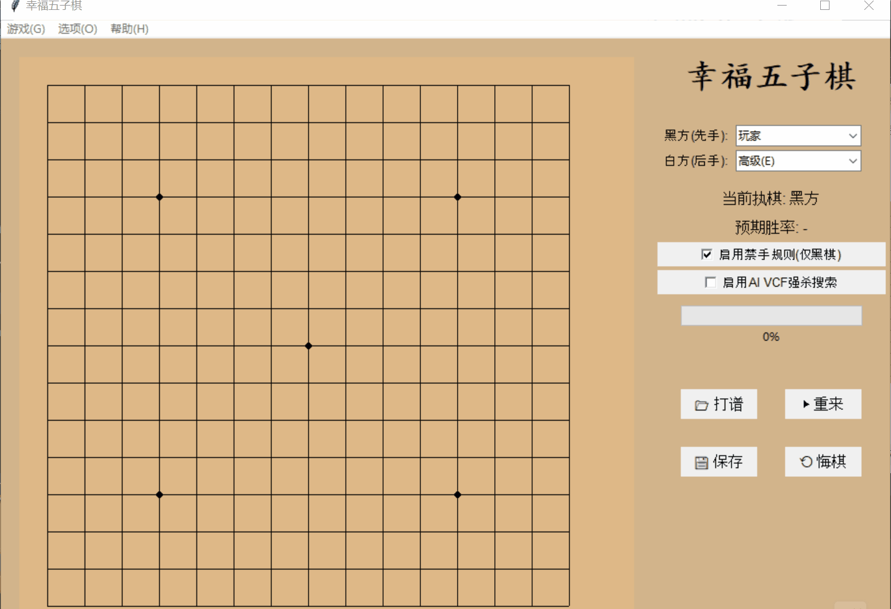

大师（Depth=4）VS 中级（Depth=2）
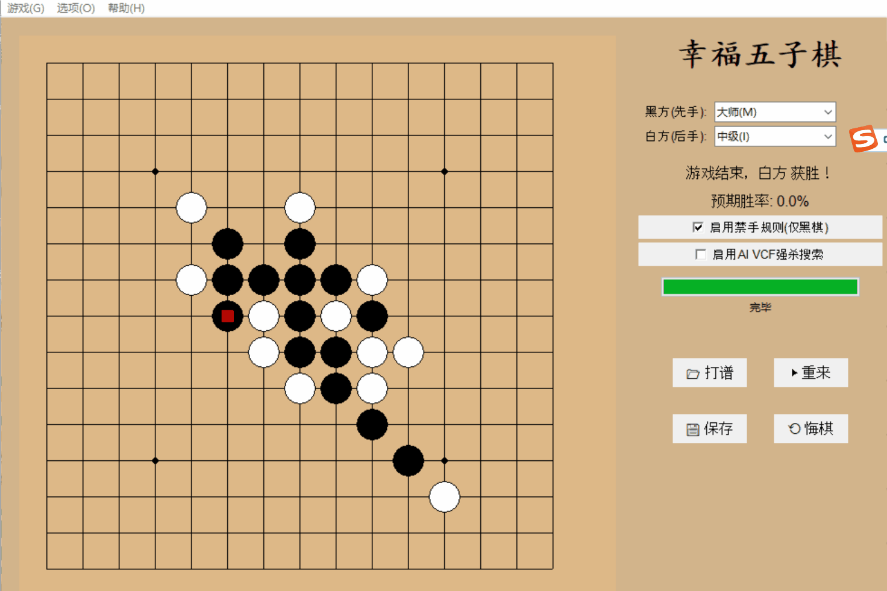

### 3. 禁手规则判定

开启禁手后，黑棋触发三三、四四或长连禁手时系统立即弹窗判负。

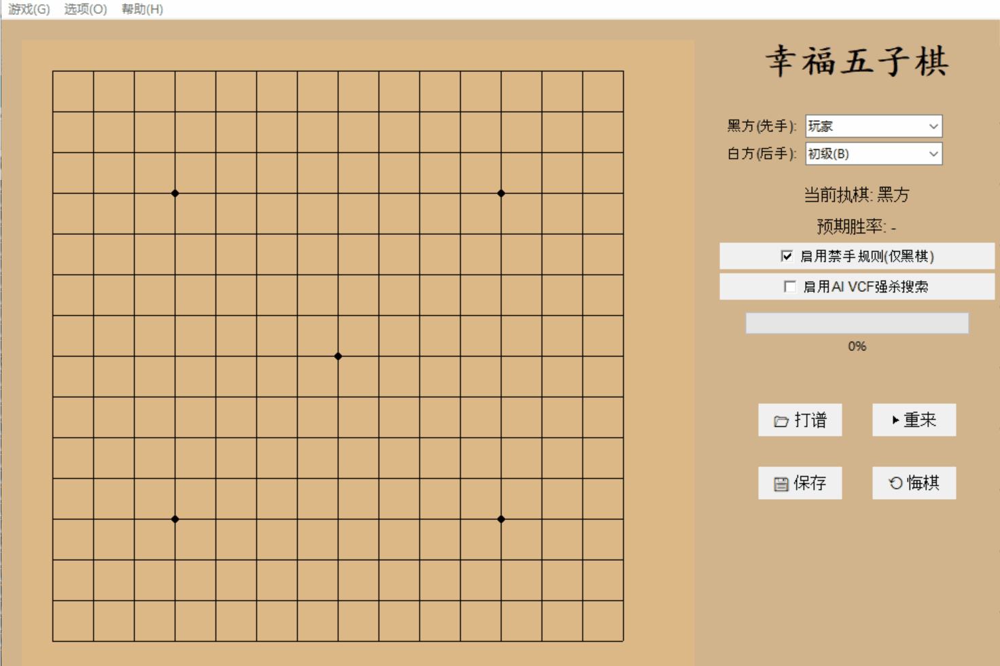

| 三三禁手实例 |
|:---:|
| 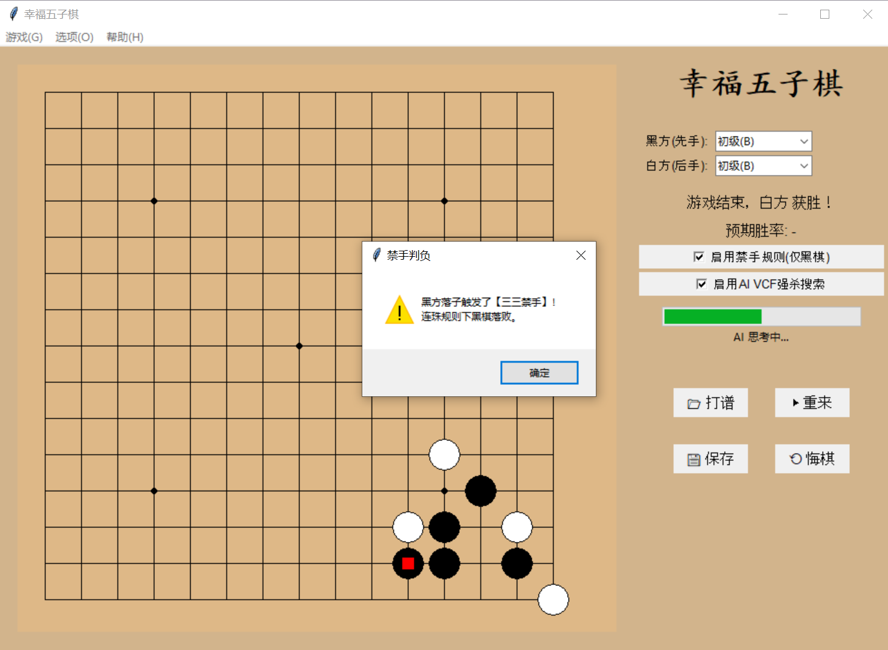 |
| 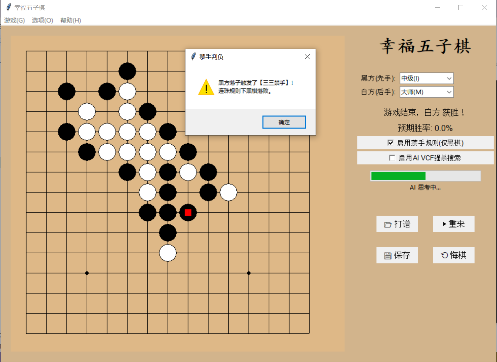 |

| 四四禁手实例 |
|:---:|
| 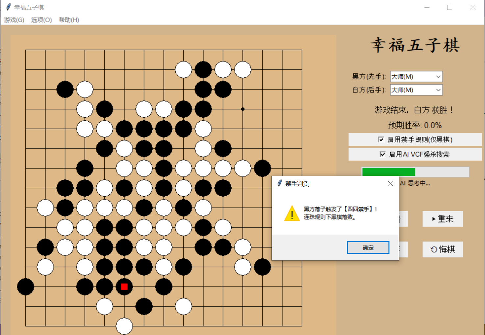 |

| 长连禁手实例 |
|:---:|
| 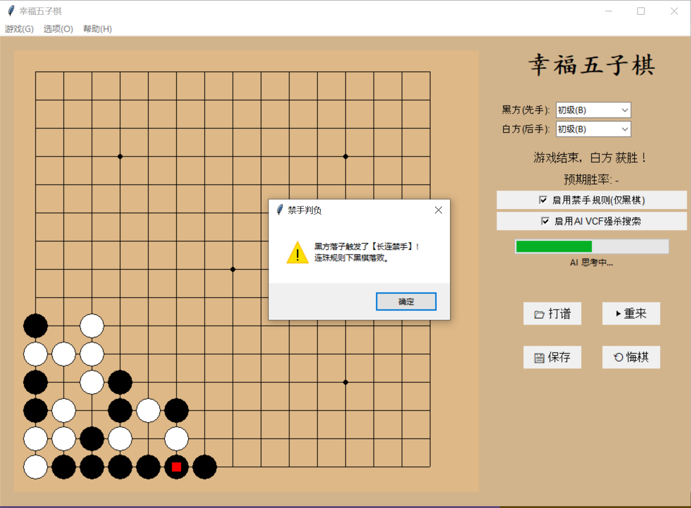 |


### 4. 复盘打谱与回放

保存棋谱后可通过"打谱"功能打开，以动画逐帧重演整局对弈。

| 回放过程 |
|:---:|
| 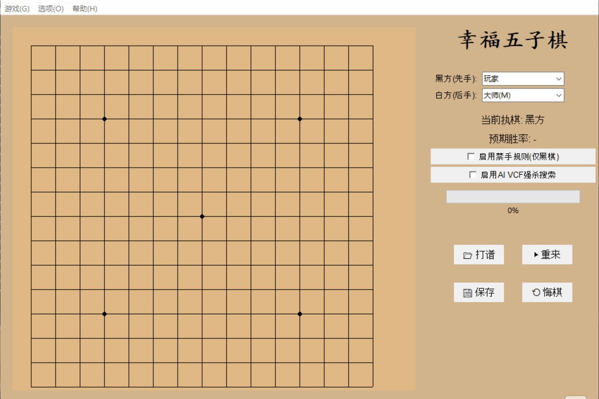 |
| 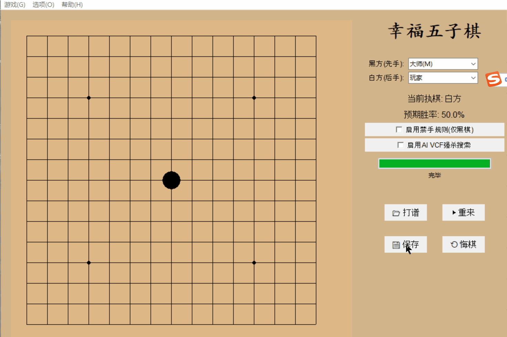 |

### 5. AI 思考过程日志

控制台实时输出各 AI 的决策耗时、搜索估值、缓存命中等信息，便于调试与性能分析。

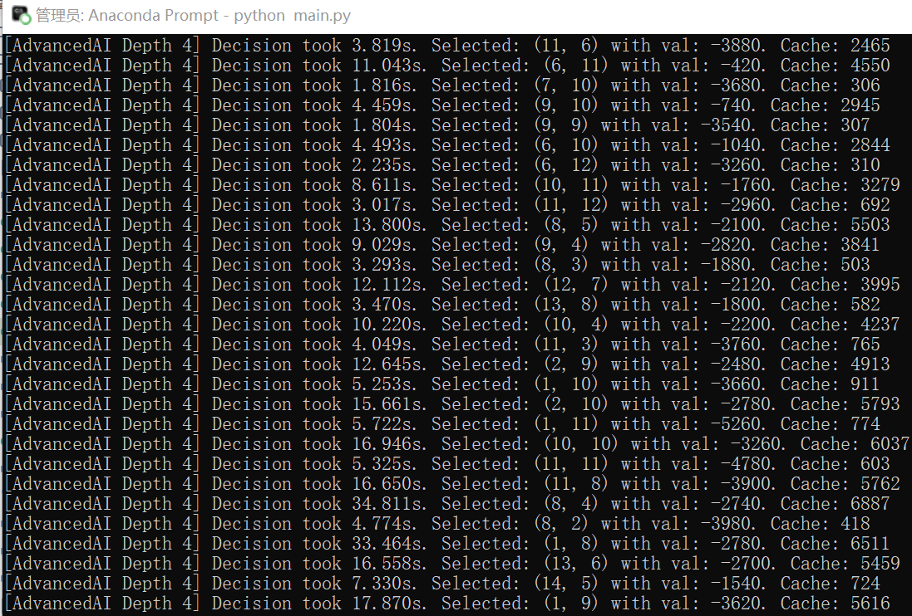

### 6. 特色功能一览

| AlphaZero 在缺乏训练时的落子，可以看成一幅画 |
|:---:|
| 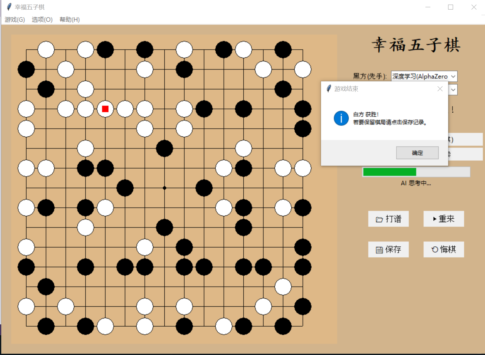 |
| 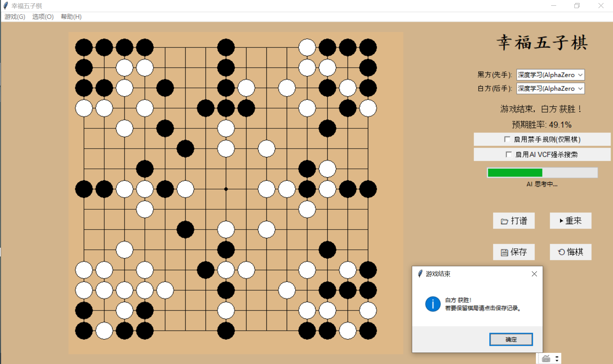 |

| 用五子棋写字 |
|:---:|
|  |

---

## 关键参数调优

| 参数 | 文件 | 默认值 | 效果 |
|------|------|--------|------|
| `depth` | ai_advanced.py | 3 (高级) / 4 (大师) | 搜索深度，越大越强越慢 |
| `time_limit` | ai_advanced.py | 5.0s | 迭代加深的时间上限 |
| `max_width` | ai_advanced.py | 15 (depth≥4) / 25 | 每层最大候选数 |
| `time_limit` | gui.py → MCTSAI | 5s | MCTS 思考时间 |
| `RAVE_K` | ai_mcts.py | 300 | RAVE 衰减速度 |
| `n_playout` | ai_alphazero.py | 400 | AlphaZero 每步推演次数 |
| 防守系数 | ai_advanced.py | 1.3 | >1 偏防守，<1 偏进攻 |

---

## 致谢

本项目的 AlphaZero 实现参考了以下开源项目：

https://github.com/junxiaosong/AlphaZero_Gomoku

基于 PyTorch 的五子棋 AlphaZero 实现，为本项目的策略价值网络与自对弈训练管道提供了重要参考。

---

## 附加文档

- **[代码解读.md](代码解读.md)**：1145 行的完整源代码逐函数解读，面向掌握 Python 基础语法的同学，从零解释所有算法原理。

---
*本项目为2026《人工智能程序设计》dyz的课程作业。*

*欢迎在GitHub上star我！*
